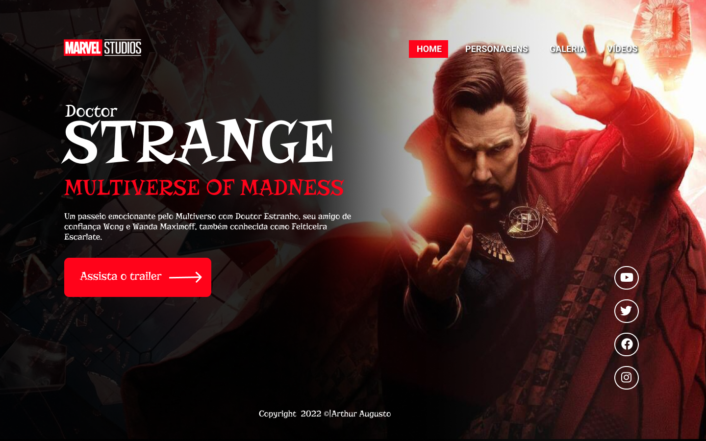
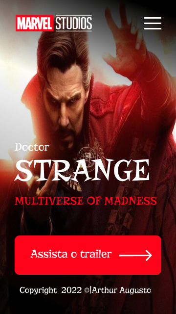
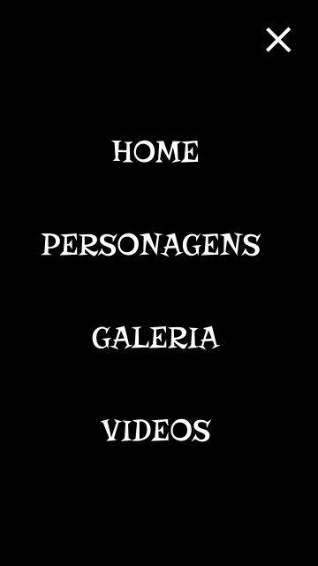

# Doctor-Strange
## Multiverse of Madness
Projeto construidp durante as aulas de LIMA, no curso de desenvolvimento do [SENAI Jandira](https://jandira.sp.senai.br/), com orientação do Prof.[Fernando Leonid](https://github.com/fernandoleonid)

---

## Qual era o objetivo do projeto?
O objetivo era criar uma landing page com base no design feito no figma, aprendendo a estrutura do HTML, CSS, JavaScript e conceitos de responsividade.

---
## O que é uma Landing Page?
Landing Pages são páginas com foco principal na conversão de visitante assim, essas páginas possuem uma estética mais minimalista se comparada com os sites tradicionais

---
## Tecnologias usadas
- HTML 5
- CSS 3
- JavaScript
- Figma

---
## Links
- [Resultado](https://arthuraugusn.github.io/doctor-strange/)

- [Projeto no Figma](https://www.figma.com/file/9CWhrOHLGic8RlvCeMDs4D/LIMA?node-id=0%3A1)

- [Código](https://github.com/arthuraugusn/doctor-strange)

---

## Autor
[Arthur Augusto](https://github.com/arthuraugusn)